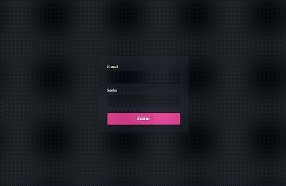
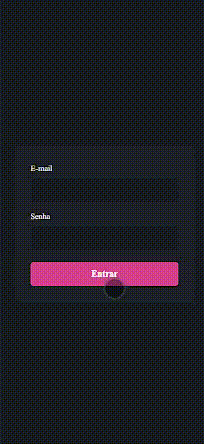

<h1 align="center">
 
    DashGo. 
 
</h1>

Foi criado uma Dashboard com formulários de validações, buscando o  máximo de aprendizado possível usando Chakra UI e React Hook Form com YUP integrado. O projeto ganhará mais funcionalidades em breve, como requisições para preencher dados tanto na tabela quanto nos gráficos, Autenticação com a API do Github usando Next Auth, entre outras, fique ligado😉.

  

    
    

---

# Projeto Hospedado

O projeto esta hospedado no Link abaixo:

<a href="https://matheus-bezerra.github.io/Instagramer/">https://matheus-bezerra.github.io/Instagramer/</a>

---
 

## Tecnologias

O projeto foi desenvolvido com as seguintes Tecnologias:

- React
- Next
- Typescript
- Chakra UI
- React Hook Form
- YUP

---

Feito por Matheus Bezerra, entre em contato pelo Linkedin --> <a href="https://www.linkedin.com/in/matheus-bezerra04/">Matheus-Bezerra04</a>

Ou entre em contato pelo Numero (11) 97661-1929

